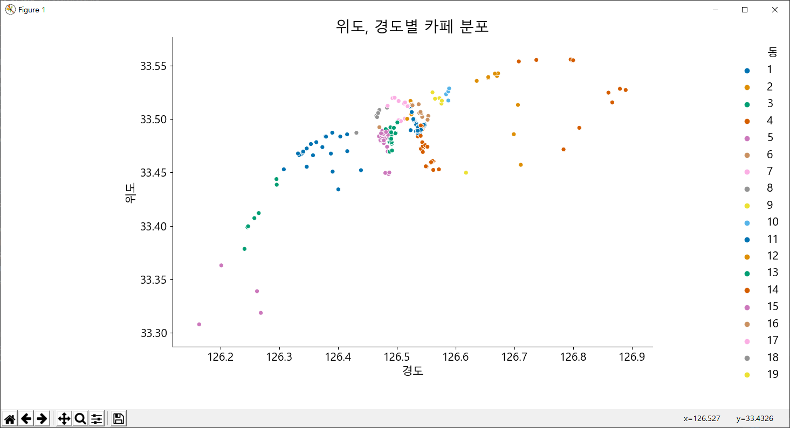
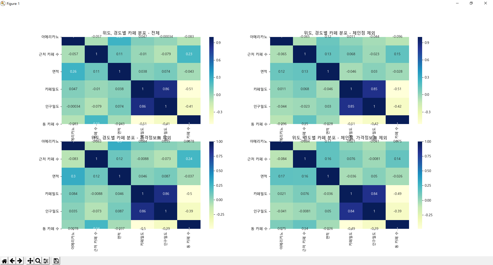
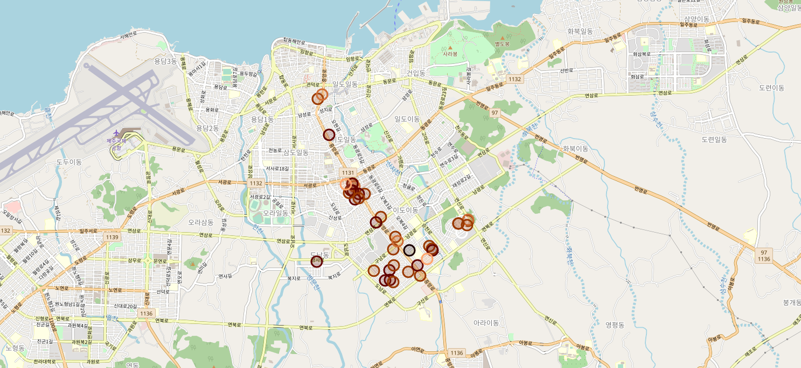

# 제주시 카페 음료 가격과 밀도간 상관관계 알아보기


>제주시의 카페의 음료(아메리카노)의 가격과 가격을 결정하는데 영향을 주리라 생각되는 요소와의 상관관계를 알아본다.<br>
> 이디야 - 스타벅스 외 여러 체인점 위치별 분석 <br>(https://github.com/corazzon/OpenDataWrangling/blob/master/store_location_by_folium.ipynb),<br>
matplotlib 상에서 한글 출력 (http://corazzon.github.io/matplotlib_font_setting) 을 참고함.

## 0. 필요 모듈 설치


```python
import numpy as np #수치계산 관련
import pandas as pd #데이터 관리
import seaborn as sns #데이터 관리2
import matplotlib as mpl #데이터 시각화
import matplotlib.pyplot as plt
import folium #지도 사용시 필요
```

## 1. 한글 폰트 적용


```python
#나눔 고딕으로 폰트 적용
mpl.rcParams['axes.unicode_minus'] = False
plt.rcParams["font.family"] = 'Malgun Gothic'
plt.rcParams["font.size"] = 15
plt.rcParams["figure.figsize"] = (14,4)
```

## 2. 데이터 불러오기

### 2.1 주변 카페 수 세기
>haversine을 활용해 주변 250m내 카페 수를 세어 csv파일에 추가했다.(수동)

### 2.2 데이터 불러오기


```python
#haversine.py
from haversine import haversine
import pandas as pd

data=pd.read_csv('cafe_data.csv', encoding='cp949')

for i in data.index:
    count=-1 #셀 때 자기 자신도 포함하므로 기본값을 -1로 설정.
    for j in data.index:
        point1 = ( data.loc[i,'위도'], data.loc[i, '경도']) #기준점
        point2 = ( data.loc[j,'위도'], data.loc[j, '경도']) #비교할위치
        if haversine(point1,point2) <= 0.25: #1=1km 0.5=500m
            count = count+1
    print(count)
```


```python
data=pd.read_csv('cafe_data.csv', encoding='cp949')
print(data.columns)
print(data.head(5))
```

>데이터 설명
1. 업소명 : 카페 이름을 표기
2. 아메리카노 : 카페의 기본 메뉴인 아메리카노의 가격을 표기.
3. 경도, 위도 : 위치정보를 표기. 지도 출력에 쓰인다
4. 면적 : 카페의 면적을 표기
5. 동 : 동을 숫자로 표기
 >> 1 - 이도동. 2 - 삼도동, 3 - 연동, 4 - 아라동, 5 - 노형동,<br>
 >> 6 - 일도동, 7 - 용담동, 8 - 도두동, 9 - 화북동, 10 - 삼양동,<br>
 >> 11 - 애월읍, 12 - 조천읍, 13 - 한림읍, 14 - 구좌읍, 15 - 한경면,<br>
 >> 16 - 이호동, 17 - 오라동, 18 - 외도동, 19 - 봉개동
6. 근처 카페 - haversine.py 에서 구한 250m내의 카페 수
7. 동 면적 : 해당 동의 면적을 표기
8. 인구 : 해당 동의 인구수 표기
9. 동 카페 수 : 동 내 카페수 표기
10. 체인점 : 체인점 여부를 표기. 0 - 체인점 아님/1-체인점
11. 가격 : 가격 정보를 단계별로 표기.
0부터 6까지 있으며 0은 가격 정보가 없는 카페이며 1부터는 1000원 단위로 끊었다.(1-1000원대, 2-2000원대, ... 6-6000원대)
12. 카페 밀도 : 해당 동의 카페 밀도를 표기
13. 인구 밀도 : 해당 동의 인구 밀도를 표기


> * 상위 5개 데이터 출력


## 3. 데이터 시각화 및 분석
### 3.1 그래프 상 카페 위치 출력


```python
sns.relplot(data=data, x="경도", y="위도", hue="동", palette=sns.color_palette("colorblind", 19))
plt.title('위도, 경도별 카페 분포',fontsize=20)
plt.show()
```

> * 출력결과 <br>


 ### 3.2 히트맵 출력
>* 전체 히트맵(아메리카노, 근처 카페 수, 면적, 카페밀도, 인구밀도, 동 카페 수)


```python
plt.subplot(2, 2, 1)
data_heatmap = data[["아메리카노", "근처 카페 수", "면적", "카페밀도", "인구밀도", "동 카페 수"]].copy()
plt.title('위도, 경도별 카페 분포 - 전체',fontsize=12)
sns.heatmap(data_heatmap.corr(), annot=True,cmap="YlGnBu",annot_kws={"size": 10})
```

>* 체인점인 카페를 제외한 히트맵


```python
plt.subplot(2, 2, 2)
data_heatmap1 = data_heatmap[(data["체인점"]==0)].copy()
plt.title('위도, 경도별 카페 분포 - 체인점 제외',fontsize=12)
sns.heatmap(data_heatmap1.corr(), annot=True,cmap="YlGnBu",annot_kws={"size": 10})
```

>* 가격정보 없는 카페를 제외한 히트맵


```python
plt.subplot(2, 2, 3)
data_heatmap2 = data_heatmap[(data['아메리카노']!=0) ].copy()
plt.title('위도, 경도별 카페 분포 - 가격정보無 제외',fontsize=12)
sns.heatmap(data_heatmap2.corr(), annot=True,cmap="YlGnBu",annot_kws={"size": 10})
```

>* 체인점인 카페, 가격정보 없는 카페 둘 다 제외한 히트맵


```python
plt.subplot(2, 2, 4)
data_heatmap3 = data_heatmap1[(data['아메리카노']!=0) ].copy()
plt.title('위도, 경도별 카페 분포 - 체인점, 가격정보無 제외',fontsize=12)
sns.heatmap(data_heatmap3.corr(), annot=True,cmap="YlGnBu",annot_kws={"size": 10})
plt.show()
```

> * 히트맵 출력 결과 <br>


## 4. 지도 제작
### 4.1 전체 지도
> * 위도 경도 값 받을 list 생성 <br>
> * marker popup 내용 설정(카페 이름 + 커피 가격)


```python
map_alt=[] #위도 값이 들어갈 list
map_long=[] #경도 값이 들어갈 list
for i in range(len(data)):
    map_alt.append(data['위도'].iloc[i])
    map_long.append(data['경도'].iloc[i])
    
# popup 창에 가격을 띄우려고 했더니 숫자형은 불가능하다고 해서 int형인 아메리카노 가격을 string으로 바꿈
# 아메리카노 가격을 제대로 인식하지 못해 데이터 index값을 저장하는 리스트를 만들어서 casting과 동시에 index 정보도 저장함.
string_price=[]
index_list = []
for a in range(len(data)):
    index_list.append(a)
    temp=str(data['아메리카노'].iloc[i])
    string_price.append((temp))
```

> * 동 별 카페 분포 표시(동마다 마커의 색을 다르게 함)


```python
map_dong=folium.Map(location=[data['위도'].iloc[0], data['경도'].iloc[0]], zoom_start=13)
for index in range(len(index_list)):
    i=index_list[index]
    if(data['동'].iloc[i]==1):
        folium.CircleMarker([map_alt[i],map_long[i]],radius=7,popup=i, color='#FF0000', fill_color='#FF0000')
        .add_child(folium.Popup(data['업소명'].iloc[i]+"\n"+string_price[i])).add_to(map_dong)
    if(data['동'].iloc[i]==2):
        folium.CircleMarker([map_alt[i],map_long[i]],radius=7,popup=i, color='#F29661', fill_color='#F29661')
        .add_child(folium.Popup(data['업소명'].iloc[i]+"\n"+string_price[i])).add_to(map_dong)
    if(data['동'].iloc[i]==3):
        folium.CircleMarker([map_alt[i],map_long[i]],radius=7,popup=i, color='#980000', fill_color='#980000')
        .add_child(folium.Popup(data['업소명'].iloc[i]+"\n"+string_price[i])).add_to(map_dong)
    if(data['동'].iloc[i]==4):
        folium.CircleMarker([map_alt[i],map_long[i]],radius=7,popup=i, color='#FFBB00', fill_color='#FFBB00')
        .add_child(folium.Popup(data['업소명'].iloc[i]+"\n"+string_price[i])).add_to(map_dong)
    if(data['동'].iloc[i]==5):
        folium.CircleMarker([map_alt[i],map_long[i]],radius=7,popup=i, color='#E5D85C', fill_color='#E5D85C')
        .add_child(folium.Popup(data['업소명'].iloc[i]+"\n"+string_price[i])).add_to(map_dong)
    if(data['동'].iloc[i]==6):
        folium.CircleMarker([map_alt[i],map_long[i]],radius=7,popup=i, color='#997000', fill_color='#997000')
        .add_child(folium.Popup(data['업소명'].iloc[i]+"\n"+string_price[i])).add_to(map_dong)
    if(data['동'].iloc[i]==7):
        folium.CircleMarker([map_alt[i],map_long[i]],radius=7,popup=i, color='#1F3456', fill_color='#1F3456')
        .add_child(folium.Popup(data['업소명'].iloc[i]+"\n"+string_price[i])).add_to(map_dong)
    if(data['동'].iloc[i]==8):
        folium.CircleMarker([map_alt[i],map_long[i]],radius=7,popup=i, color='#ABF200', fill_color='#ABF200')
        .add_child(folium.Popup(data['업소명'].iloc[i]+"\n"+string_price[i])).add_to(map_dong)
    if(data['동'].iloc[i]==9):
        folium.CircleMarker([map_alt[i],map_long[i]],radius=7,popup=i, color='#86E57F', fill_color='#86E57F')
        .add_child(folium.Popup(data['업소명'].iloc[i]+"\n"+string_price[i])).add_to(map_dong)
    if(data['동'].iloc[i]==10):
        folium.CircleMarker([map_alt[i],map_long[i]],radius=7,popup=i, color='#6B9900', fill_color='#6B9900')
        .add_child(folium.Popup(data['업소명'].iloc[i]+"\n"+string_price[i])).add_to(map_dong)
    if(data['동'].iloc[i]==11):
        folium.CircleMarker([map_alt[i],map_long[i]],radius=7,popup=i, color='#00D8FF', fill_color='#00D8FF')
        .add_child(folium.Popup(data['업소명'].iloc[i]+"\n"+string_price[i])).add_to(map_dong)
    if(data['동'].iloc[i]==12):
        folium.CircleMarker([map_alt[i],map_long[i]],radius=7,popup=i, color='#6799FF', fill_color='#6799FF')
        .add_child(folium.Popup(data['업소명'].iloc[i]+"\n"+string_price[i])).add_to(map_dong)
    if(data['동'].iloc[i]==13):
        folium.CircleMarker([map_alt[i],map_long[i]],radius=7,popup=i, color='#008299', fill_color='#008299')
        .add_child(folium.Popup(data['업소명'].iloc[i]+"\n"+string_price[i])).add_to(map_dong)
    if(data['동'].iloc[i]==14):
        folium.CircleMarker([map_alt[i],map_long[i]],radius=7,popup=i, color='#0100FF', fill_color='#0100FF')
        .add_child(folium.Popup(data['업소명'].iloc[i]+"\n"+string_price[i])).add_to(map_dong)
    if(data['동'].iloc[i]==15):
        folium.CircleMarker([map_alt[i],map_long[i]],radius=7,popup=i, color='#A566FF', fill_color='#A566FF')
        .add_child(folium.Popup(data['업소명'].iloc[i]+"\n"+string_price[i])).add_to(map_dong)
    if(data['동'].iloc[i]==16):
        folium.CircleMarker([map_alt[i],map_long[i]],radius=7,popup=i, color='#D26C9F', fill_color='#D26C9F')
        .add_child(folium.Popup(data['업소명'].iloc[i]+"\n"+string_price[i])).add_to(map_dong)
    if(data['동'].iloc[i]==17):
        folium.CircleMarker([map_alt[i],map_long[i]],radius=7,popup=i, color='#FF00DD', fill_color='#FF00DD')
        .add_child(folium.Popup(data['업소명'].iloc[i]+"\n"+string_price[i])).add_to(map_dong)
    if(data['동'].iloc[i]==18):
        folium.CircleMarker([map_alt[i],map_long[i]],radius=7,popup=i, color='#F361A6', fill_color='#F361A6')
        .add_child(folium.Popup(data['업소명'].iloc[i]+"\n"+string_price[i])).add_to(map_dong)
    if(data['동'].iloc[i]==19):
        folium.CircleMarker([map_alt[i],map_long[i]],radius=7,popup=i, color='#990085', fill_color='#990085')
        .add_child(folium.Popup(data['업소명'].iloc[i]+"\n"+string_price[i])).add_to(map_dong)

map_dong.save('map_dong.html', encoding='utf-8')
```

> * 출력결과<br>


> * 커피 가격 표시(가격대는 1000원대~6000원대로 가격이 비쌀 수록 가격을 짙게 함. 가격 정보가 없는 것은 하얀색으로 표기)


```python
map_dong_price=folium.Map(location=[data['위도'].iloc[0], data['경도'].iloc[0]], zoom_start=13)
for index in range(len(index_list)):
    i=index_list[index]
    if(data['가격'].iloc[i]==1):
        folium.CircleMarker([map_alt[i],map_long[i]],radius=7, color='#FFA46C', fill_color='#FFA46C')
        .add_child(folium.Popup(data['업소명'].iloc[i]+"\n"+string_price[i])).add_to(map_dong_price)
    if(data['가격'].iloc[i]==2):
        folium.CircleMarker([map_alt[i],map_long[i]],radius=7, color='#CF6E36', fill_color='#CF6E36')
        .add_child(folium.Popup(data['업소명'].iloc[i]+"\n"+string_price[i])).add_to(map_dong_price)
    if(data['가격'].iloc[i]==3):
        folium.CircleMarker([map_alt[i],map_long[i]],radius=7, color='#993800', fill_color='#993800')
        .add_child(folium.Popup(data['업소명'].iloc[i]+"\n"+string_price[i])).add_to(map_dong_price)
    if(data['가격'].iloc[i]==4):
        folium.CircleMarker([map_alt[i],map_long[i]],radius=7, color='#630200', fill_color='#630200')
        .add_child(folium.Popup(data['업소명'].iloc[i]+"\n"+string_price[i])).add_to(map_dong_price)
    if(data['가격'].iloc[i]==5):
        folium.CircleMarker([map_alt[i],map_long[i]],radius=7, color='#2D0000', fill_color='#2D0000')
        .add_child(folium.Popup(data['업소명'].iloc[i]+"\n"+string_price[i])).add_to(map_dong_price)
    if(data['가격'].iloc[i]==6):
        folium.CircleMarker([map_alt[i],map_long[i]],radius=7, color='#1B0000', fill_color='#1B0000')
        .add_child(folium.Popup(data['업소명'].iloc[i]+"\n"+string_price[i])).add_to(map_dong_price)
    if(data['가격'].iloc[i]==0):
        folium.CircleMarker([map_alt[i],map_long[i]],radius=7, color='#FFFFFF', fill_color='#FFFFFF')
        .add_child(folium.Popup(data['업소명'].iloc[i]+"\n"+string_price[i])).add_to(map_dong_price)
        
map_dong_price.save('map_all.html', encoding='utf-8') 
```

> * 출력결과<br>


> * 각 동별로 카페 커피 가격을 표시


```python
index_list = []
for i in range(len(data)):
    if(data['동'].iloc[i]==14):
        index_list.append(i) 
        map_alt.append(data['위도'].iloc[i])
        map_long.append(data['경도'].iloc[i])

point=index_list[0]

for i in range(len(data)):
    if(data['가격'].iloc[i]==1):
        folium.CircleMarker([data['위도'].iloc[i],data['경도'].iloc[i]],radius=10, color='#FFA46C', fill_color='#FFA46C')
        .add_child(folium.Popup(data['업소명'].iloc[i]+"\n"+string_price[i])).add_to(map)
    if(data['가격'].iloc[i]==2):
        folium.CircleMarker([data['위도'].iloc[i],data['경도'].iloc[i]],radius=10, color='#CF6E36', fill_color='#CF6E36')
        .add_child(folium.Popup(data['업소명'].iloc[i]+"\n"+string_price[i])).add_to(map)
    if(data['가격'].iloc[i]==3):
        folium.CircleMarker([data['위도'].iloc[i],data['경도'].iloc[i]],radius=10, color='#993800', fill_color='#993800')
        .add_child(folium.Popup(data['업소명'].iloc[i]+"\n"+string_price[i])).add_to(map)
    if(data['가격'].iloc[i]==4):
        folium.CircleMarker([data['위도'].iloc[i],data['경도'].iloc[i]],radius=10, color='#630200', fill_color='#630200')
        .add_child(folium.Popup(data['업소명'].iloc[i]+"\n"+string_price[i])).add_to(map)
    if(data['가격'].iloc[i]==5):
        folium.CircleMarker([data['위도'].iloc[i],data['경도'].iloc[i]],radius=10, color='#2D0000', fill_color='#2D0000')
        .add_child(folium.Popup(data['업소명'].iloc[i]+"\n"+string_price[i])).add_to(map)
    if(data['가격'].iloc[i]==6):
        folium.CircleMarker([data['위도'].iloc[i],data['경도'].iloc[i]],radius=10, color='#1B0000', fill_color='#1B0000')
        .add_child(folium.Popup(data['업소명'].iloc[i]+"\n"+string_price[i])).add_to(map)
    if(data['가격'].iloc[i]==0):
        folium.CircleMarker([data['위도'].iloc[i],data['경도'].iloc[i]],radius=10, color='#FFFFFF', fill_color='#FFFFFF')
        .add_child(folium.Popup(data['업소명'].iloc[i]+"\n"+string_price[i])).add_to(map)

map.save('map_1.html', encoding='utf-8')
```

> * 출력결과(예시로 이도동만 출력)

